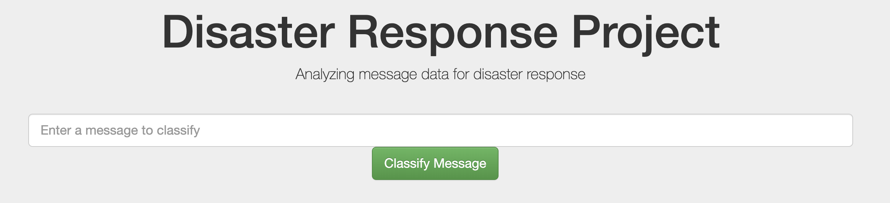
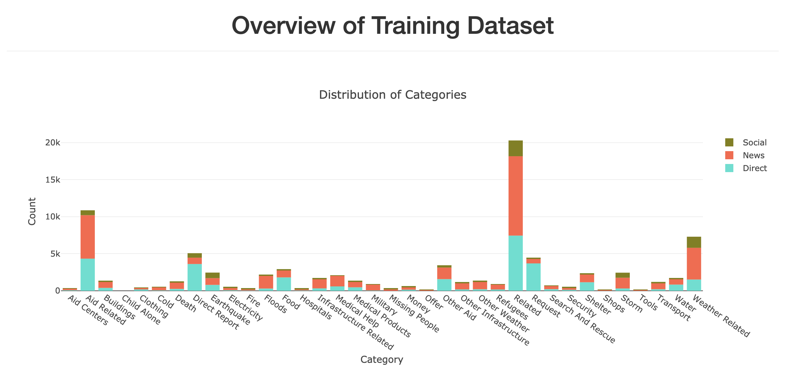

# Disaster Relief Pipeline and Interactive Dashboard

This project utilizes an ETL pipeline and ML pipeline to load and preprocess a dataset of labeled disaster-resposne messages then train a multi-output classifier to predict new messages.

You can interact with a trained classifier and look at a couple plots describing the training dataset [in this interactive webapp](https://pd-disasterrelief.herokuapp.com/).

## Repo Contents

- data
    - DisasterResponse.db: cleaned and preprocessed data ready to train a multi-output classiier. Output from `process_data.py`.
    - disaster_categories.csv: dataset containing messages' labels/categories
    - disaster_messages.csv: dataset containing messages
    - process_data.py: script used to preprocess files like `disaster_categories.csv` and `disaster_messages.csv`
- templates
    - go.html: extentsion of `master.html` used to modify the webpage with classification results from user's query
    - master.html: landing webpage for the project
- Procfile: used to deploy the Heroku webapp
- classifier.joblib: pickled trained pipeline output from `train_classifier.py`.
- cust_tokenizer.py: containes `tokenize_stem` function used in `train_classifier.py` and `run.py`.
- requirements.txt: contains library versions required to host webapp. Required for Heroku.
- run.py: script used to run webapp
- train_classifier.py: script used to train a Multi-Output Classifier on preprocessed message data

## Instructions

In order to use the scripts yourself, clone this repo then...

1. run process_data.py with the following three arguments:
    -  \<messages file\> \<categories file\> \<cleaned data filepath\>
    - i.e. `python process_data.py disaster_messages.csv disaster_categories.csv DisasterResponse.db`
2. This should create a database file at the filepath of your choosing. Then, run train_classifier.py with the following two arguments:
    - \<cleaned data filepath\> \<model pickle filepath\>
    - i.e. `python train_classifier.py ../data/DisasterResponse.db classifier.joblib`
3. This will train a model on the database file from step 1 then save it as a pickled file. 

A pickled model was loaded into the webapp linked at the top for you to use if you want! 

Just type in a message into the textbox above and click **Classify Message**.

## Class Imbalance Limitation

The training dataset classes are heavily imbalanced. The screenshot below shows one of the plots that can be found in the webpage.

This is a barplot counting occurrence for each instance a message was labeled as one of the 36 categories. Some categories have very few examples (Child Alone has 0!) and some examples have many examples (Related).

Models work best when classes are roughly evenly distributed. Thus, when optimizing a model like this, it's important to optimize a metric like **recall** $$e=mc^2$$ 

## Dependencies

- sqlalchemy
- plotly
- pandas
- nltk
- flask
- sklearn
- gunicorn